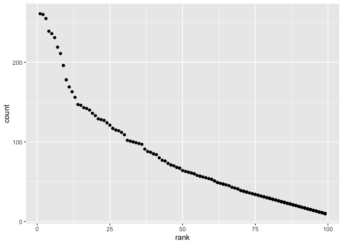

Data Science HW\#2
================
Sophia Miller
10/1/2019

# Loading necessary packages

``` r
library(tidyverse)
```

    ## ── Attaching packages ────────────────────────────────────────────────────────────────────── tidyverse 1.2.1 ──

    ## ✔ ggplot2 3.2.1     ✔ purrr   0.3.2
    ## ✔ tibble  2.1.3     ✔ dplyr   0.8.3
    ## ✔ tidyr   1.0.0     ✔ stringr 1.4.0
    ## ✔ readr   1.3.1     ✔ forcats 0.4.0

    ## ── Conflicts ───────────────────────────────────────────────────────────────────────── tidyverse_conflicts() ──
    ## ✖ dplyr::filter() masks stats::filter()
    ## ✖ dplyr::lag()    masks stats::lag()

``` r
library(readxl)
```

# Problem 1

## Read and clean Mr. Trash Wheel sheet

#### *The code chunk below does the following:*

  - *Specifies the relevant sheet in the Excel file*
  - *Omits rows without dumpster-specific data*
  - *Rounds number of sports balls to the nearest integer and converts
    result to an integer variable*

<!-- end list -->

``` r
trashwheel_data = read_excel(
  path = "data/Trash-Wheel-Collection-Totals-8-6-19.xlsx",
  sheet = "Mr. Trash Wheel",
  range = "A2:N408",
  col_names = TRUE) %>%
  janitor::clean_names() %>%
  drop_na(dumpster) %>%
  mutate(
    sports_balls = as.integer(round(sports_balls, 0))
    )
```

## Read and clean precipitation data for 2017 and 2018

#### *The two code chunks below omit rows without precipitation data and add a `year` variable:*

``` r
precip_data_2017 = read_excel(
  path = "data/Trash-Wheel-Collection-Totals-8-6-19.xlsx",
  sheet = "2017 Precipitation",
  col_names = TRUE,
  skip = 1) %>%
  janitor::clean_names() %>%
  drop_na(month) %>%
  mutate(year = 2017)
```

``` r
precip_data_2018 = read_excel(
  path = "data/Trash-Wheel-Collection-Totals-8-6-19.xlsx",
  sheet = "2018 Precipitation",
  col_names = TRUE,
  skip = 1) %>%
  janitor::clean_names() %>%
  drop_na(month) %>%
  mutate(year = 2018)
```

## Combining precipitation datasets and converting `month` to a character variable

``` r
precip_data = 
  full_join(precip_data_2017, precip_data_2018, by = NULL) %>%
 mutate(
    month = as.numeric(month),
    month = month.name[month]
    )
```

    ## Joining, by = c("month", "total", "year")

There are 24 observations and 3 variables in the precipitation dataset.
Key variables in the precipitation dataset include month, year, and
`total`, which shows total precipitation in a given year/month. Total
precipitation in 2018 was 70.33. Total precipication in 2017 was 32.93.

There are in 344 observations and 14 variables in the trashwheel
dataset. Key variables include dumpster number (`dumpster`), weight of
litter collected (`weight_in_tons`), volume of litter collected
(`volume_cubic_yards`), and number of homes powered (`homes_powered`).
For example, 33.38 tons of trash were collected in May 2019. The dataset
also contains information on the quantity of different types of litter
collected in a dumpster. For example, the median number of sports balls
in a dumpster in 2017 was 8 and the median number of plastic bottles in
a dumpster in 2018 was 1200.

# Problem 2

## Read and clean pols-month data

#### *The code chunk below does the following:*

  - *Separates the `mon` variable into `year`, `month`, and `day`*
  - *Converts `month` to a character variable*
  - *Creates a `president` variable that indicates if a president at a
    given year/month was a democrat or republican*
  - *Removes the `prez_dem`, `prez_gop`, and `day` variables*

<!-- end list -->

``` r
pols_month_data = read_csv(file = "./data/pols-month.csv") %>%
janitor::clean_names() %>%
separate(mon, c("year","month","day")) %>%
  mutate(
    month = as.numeric(month),
    month = month.abb[month],
    president = prez_dem,
    president = recode(president, '1' = "dem", '0' = "gop"),
    year = as.numeric(year)) %>%
  select(-day, -prez_gop, -prez_dem)
```

    ## Parsed with column specification:
    ## cols(
    ##   mon = col_date(format = ""),
    ##   prez_gop = col_double(),
    ##   gov_gop = col_double(),
    ##   sen_gop = col_double(),
    ##   rep_gop = col_double(),
    ##   prez_dem = col_double(),
    ##   gov_dem = col_double(),
    ##   sen_dem = col_double(),
    ##   rep_dem = col_double()
    ## )

## Read and clean snp data

#### *The code chunk below cleans the data in snp.csv similarly to `pols_month_data`, arranges the data in chronological order by `year` and `month`, and makes `year` and `month` the leading columns.*

``` r
snp_data = read_csv(file = "./data/snp.csv") %>%
janitor::clean_names() %>%
separate(date, c("month","day","year")) %>%
select(year, month, close, -day) %>%
  mutate(month = as.factor(month)) %>%
  arrange(year, month) %>%
mutate(
  month = month.abb[(as.numeric(month))],
  year = as.numeric(year))
```

    ## Parsed with column specification:
    ## cols(
    ##   date = col_character(),
    ##   close = col_double()
    ## )

## Read and clean unemployment data

#### *The code chunk below converts the data in unemployment.csv from wide to long format and mutates the `month` variable values to title case to match the `month` values in `snp_data` and `pols_month_data` so that they can be joined.*

``` r
unemployment_data = read_csv(file = "./data/unemployment.csv") %>%
janitor::clean_names() %>%
  pivot_longer(
    jan:dec,
    names_to = "month",
    values_to = "percent_unemployment"
    ) %>%
    mutate(
      year = as.numeric(year),
      month = str_to_title(month))
```

    ## Parsed with column specification:
    ## cols(
    ##   Year = col_double(),
    ##   Jan = col_double(),
    ##   Feb = col_double(),
    ##   Mar = col_double(),
    ##   Apr = col_double(),
    ##   May = col_double(),
    ##   Jun = col_double(),
    ##   Jul = col_double(),
    ##   Aug = col_double(),
    ##   Sep = col_double(),
    ##   Oct = col_double(),
    ##   Nov = col_double(),
    ##   Dec = col_double()
    ## )

## Join `pols_month_data`, `snp_data`, and `unemployment_data`

``` r
politics_data = 
  left_join(pols_month_data, snp_data, by = c("year", "month")) %>% 
  left_join( unemployment_data, by = c("year", "month"))
```

The `pols_month_data` dataset contains information about the number of
politicians who are democratic or republican at a given time point. The
`snp_data` dataset contains information about the closing value of
Standard & Poor’s stock market index on a given date. The
`unemployment_data` dataset contains information about the percentage of
unemployment in a given month of an associated year. The dataset
`politics_data`, which results from combining the three datasets, has
822 rows and 11 columns. The years range from 1947 to 2015. Key
variables in the `politics` dataset include `president`, which indicates
if the president was a democrat or republican during a given year/month,
`unemployment`, which indicates the percent unemployment during a given
year/month, and `close`, which indicates the closing value of Standard &
Poor’s stock market during a given year/month. For example, we can see
that the mean percent unemployment under a republican president was
5.9310185 while the median percent unemployment under a democratic
president was
5.7145503.

# Problem 3

## Read and clean baby name popularity data

#### *The code chunk below standardizes ethnicity names and the case of the `childs_first_name` variable, and removes duplicate rows.*

``` r
baby_name_data = 
  read_csv("./data/Popular_Baby_Names.csv") %>%
  janitor::clean_names() %>%
  mutate(
    ethnicity = recode(ethnicity, "ASIAN AND PACI" = "ASIAN AND PACIFIC ISLANDER", "BLACK NON HISP" = "BLACK NON HISPANIC", "WHITE NON HISP" = "WHITE NON HISPANIC"),
    childs_first_name = str_to_upper(childs_first_name)) %>%
  distinct(.keep_all = TRUE)
```

    ## Parsed with column specification:
    ## cols(
    ##   `Year of Birth` = col_double(),
    ##   Gender = col_character(),
    ##   Ethnicity = col_character(),
    ##   `Child's First Name` = col_character(),
    ##   Count = col_double(),
    ##   Rank = col_double()
    ## )

## Making a table that shows the popularity of the name Olivia among girls over time

``` r
baby_name_data %>%
  filter(childs_first_name == "OLIVIA", gender == "FEMALE") %>% 
  select(year_of_birth, ethnicity, rank) %>%
  pivot_wider(
    names_from = "year_of_birth",
    values_from = "rank"
  ) %>% 
  knitr::kable(format = 'pandoc', caption = "Popularity of Name Olivia among Female Babies by Ethnicity Over Time (2011-2016)")
```

| ethnicity                  | 2016 | 2015 | 2014 | 2013 | 2012 | 2011 |
| :------------------------- | ---: | ---: | ---: | ---: | ---: | ---: |
| ASIAN AND PACIFIC ISLANDER |    1 |    1 |    1 |    3 |    3 |    4 |
| BLACK NON HISPANIC         |    8 |    4 |    8 |    6 |    8 |   10 |
| HISPANIC                   |   13 |   16 |   16 |   22 |   22 |   18 |
| WHITE NON HISPANIC         |    1 |    1 |    1 |    1 |    4 |    2 |

Popularity of Name Olivia among Female Babies by Ethnicity Over Time
(2011-2016)

## Making a table that shows the most popular name among boys over time

``` r
baby_name_data %>% 
  filter(rank == "1", gender == "MALE") %>% 
  select(year_of_birth, ethnicity, childs_first_name) %>% 
  pivot_wider(
    names_from = "year_of_birth",
    values_from = "childs_first_name"
  ) %>%
  knitr::kable(format = 'pandoc', caption = "Most Popular Male Baby Name by Ethnicity Over Time (2011-2016)")
```

| ethnicity                  | 2016   | 2015   | 2014   | 2013   | 2012   | 2011    |
| :------------------------- | :----- | :----- | :----- | :----- | :----- | :------ |
| ASIAN AND PACIFIC ISLANDER | ETHAN  | JAYDEN | JAYDEN | JAYDEN | RYAN   | ETHAN   |
| BLACK NON HISPANIC         | NOAH   | NOAH   | ETHAN  | ETHAN  | JAYDEN | JAYDEN  |
| HISPANIC                   | LIAM   | LIAM   | LIAM   | JAYDEN | JAYDEN | JAYDEN  |
| WHITE NON HISPANIC         | JOSEPH | DAVID  | JOSEPH | DAVID  | JOSEPH | MICHAEL |

Most Popular Male Baby Name by Ethnicity Over Time
(2011-2016)

## Making a scatterplot that plots the number of children with a given name vs. the popularity rank of that name

``` r
baby_subset = 
  filter(baby_name_data, gender == "MALE", ethnicity == "WHITE NON HISPANIC", year_of_birth == "2016" )

ggplot(baby_subset, aes(x = rank, y = count)) + geom_point()
```

<!-- -->
